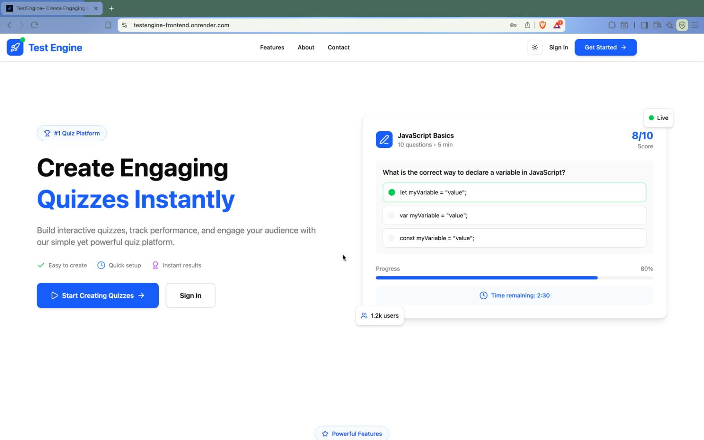
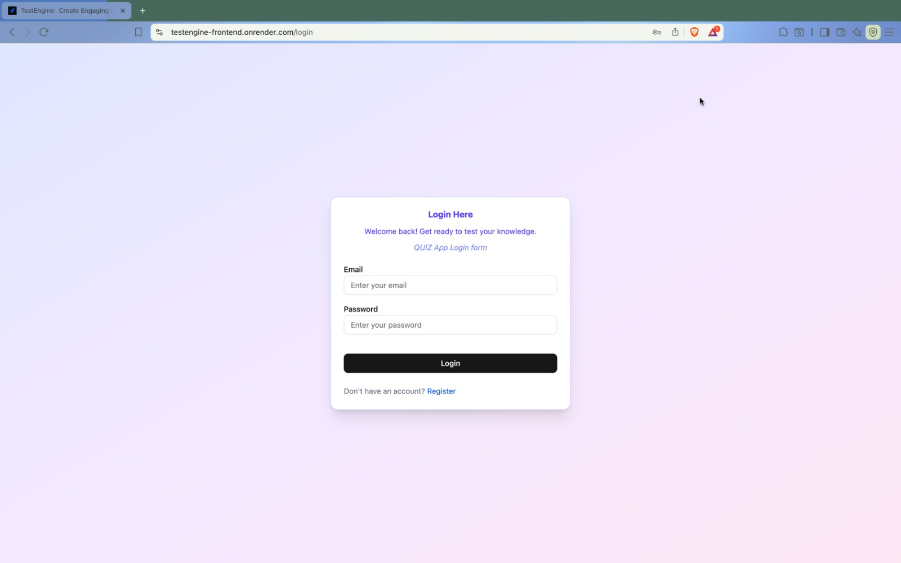
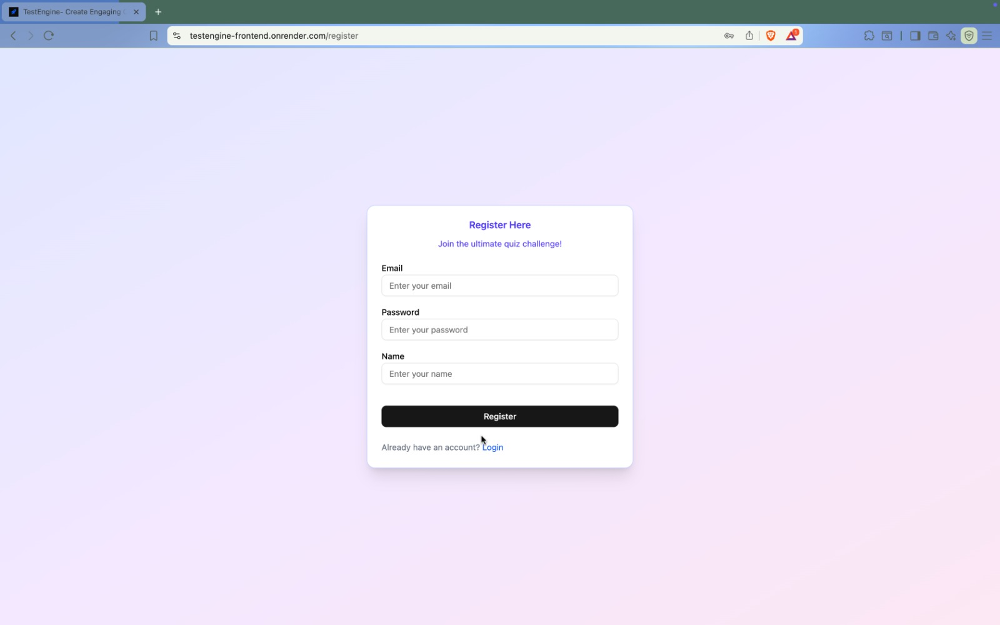
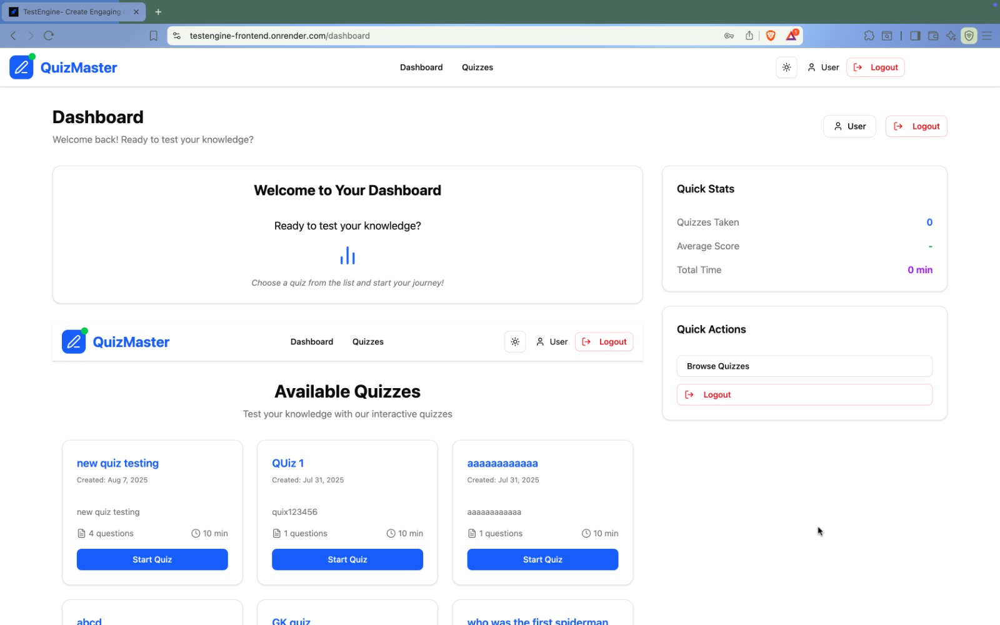
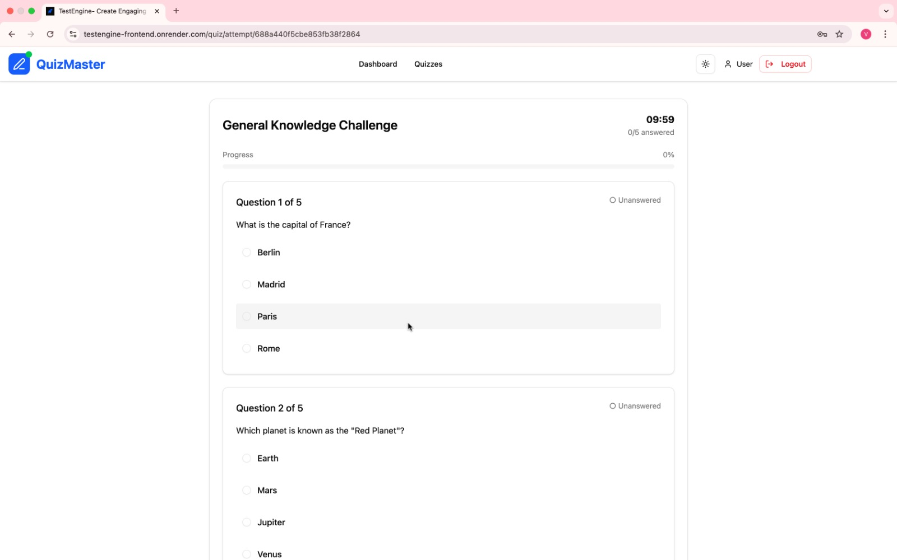
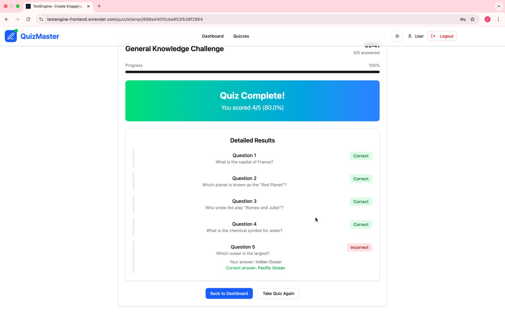
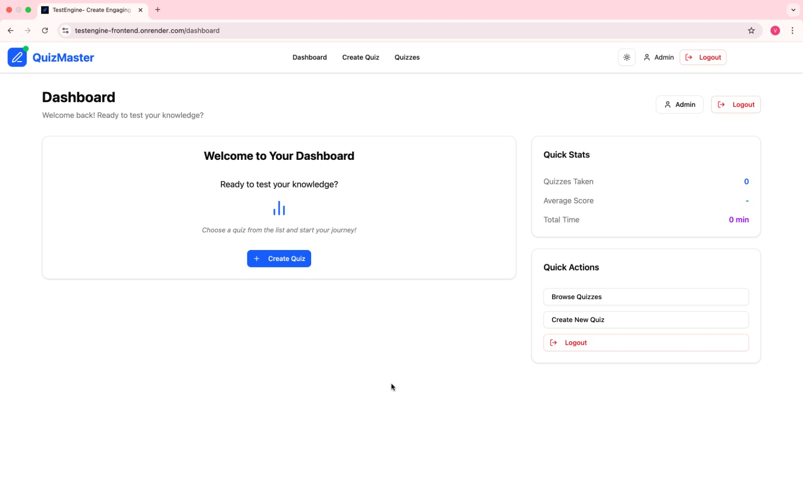
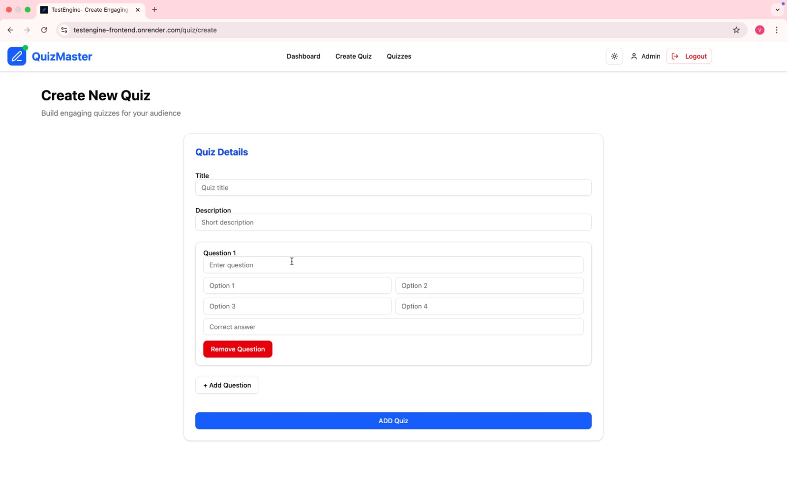

# TestEngine - MERN Stack Quiz Application

**TestEngine** is a full-stack quiz application built with the MERN stack that allows users to sign up, take quizzes, and view scores, while admins can create quizzes manually or generate them using the OpenAI API. Designed for rapid deployment, TestEngine is secure, modular, and demo-ready — perfect for students, educators, or teams.

## 🚀 Live Demo

**Frontend**: [https://testengine-frontend.onrender.com/](https://testengine-frontend.onrender.com/)

## 📋 Features

### For Users
- ✅ **User Registration & Authentication** - Secure signup and login
- ✅ **Quiz Taking Interface** - Interactive quiz experience with multiple choice questions
- ✅ **Score Tracking** - View quiz results and performance history
- ✅ **Responsive Design** - Works seamlessly on desktop and mobile devices

### For Admins
- ✅ **Admin Dashboard** - Comprehensive management interface
- ✅ **Manual Quiz Creation** - Create custom quizzes with multiple questions
- ✅ **AI-Powered Quiz Generation** - Generate quizzes automatically using Google Gemini AI
- ✅ **User Management** - View and manage registered users
- ✅ **Quiz Analytics** - Monitor quiz performance and user engagement

### Security & Performance
- 🔐 **JWT Authentication** - Secure token-based authentication
- 🛡️ **Password Hashing** - Bcrypt for secure password storage
- ⚡ **Optimized Performance** - Fast loading and responsive UI
- 📱 **Mobile Responsive** - Tailwind CSS for consistent design

## 🛠️ Tech Stack

### Frontend
- **React 19** - Modern React with latest features
- **TypeScript** - Type-safe development
- **Tailwind CSS** - Utility-first CSS framework
- **Shadcn/UI** - Beautiful and accessible components
- **React Hook Form** - Performant forms with easy validation
- **Zod** - TypeScript-first schema validation
- **React Router Dom** - Client-side routing
- **Axios** - HTTP client for API calls
- **Vite** - Fast build tool and development server

### Backend
- **Node.js** - JavaScript runtime
- **Express.js** - Web application framework
- **MongoDB** - NoSQL database with Mongoose ODM
- **JWT** - JSON Web Tokens for authentication
- **Bcrypt** - Password hashing
- **Google Gemini AI** - AI-powered quiz generation
- **CORS** - Cross-origin resource sharing

### Deployment
- **Render** - Cloud platform for deployment
- **Environment Variables** - Secure configuration management

## 📁 Project Structure

```
TestEngine/
├── back-end/                   # Backend API server
│   ├── api/                   # API route handlers
│   │   ├── gemini-routes.js   # AI quiz generation routes
│   │   ├── quiz-routes.js     # Quiz CRUD operations
│   │   └── user-routes.js     # User authentication routes
│   ├── controllers/           # Business logic controllers
│   │   ├── gemini-controller.js
│   │   ├── quiz-controller.js
│   │   └── user-controller.js
│   ├── models/               # Database models
│   │   ├── question-model.js
│   │   ├── quiz-model.js
│   │   └── user-model.js
│   ├── services/             # Business services
│   │   ├── quiz-service.js
│   │   └── user-service.js
│   ├── utils/                # Utility functions
│   │   └── db/
│   │       └── connection.js
│   ├── middlewares/          # Custom middleware
│   │   ├── 404.js
│   │   └── auth.js
│   └── server.js             # Main server file
│
├── front-end/                # Frontend React application
│   ├── src/
│   │   ├── components/       # Reusable React components
│   │   │   └── ui/           # Shadcn UI components
│   │   ├── lib/              # Utility libraries
│   │   ├── modules/          # Feature modules
│   │   │   ├── landing/      # Landing page components
│   │   │   ├── quiz/         # Quiz-related components
│   │   │   └── user/         # User dashboard components
│   │   ├── pages/            # Page components
│   │   │   ├── HomePage.tsx
│   │   │   ├── Dashboard.tsx
│   │   │   ├── Login.tsx
│   │   │   ├── Register.tsx
│   │   │   └── NotFound.tsx
│   │   ├── validations/      # Zod validation schemas
│   │   └── App.tsx           # Main App component
│   └── public/               # Static assets
└── README.md                 # Project documentation
```

## 🚀 Getting Started

### Prerequisites
- Node.js (v18 or higher)
- MongoDB (local installation or MongoDB Atlas)
- Git

### Installation

1. **Clone the repository**
   ```bash
   git clone https://github.com/Suyalvivek/TestEngine-MERN.git
   cd TestEngine-MERN
   ```

2. **Backend Setup**
   ```bash
   cd back-end
   npm install
   ```

   Create a `.env` file in the backend directory:
   ```env
   PORT=5000
   MONGODB_URI=your_mongodb_connection_string
   JWT_SECRET=your_jwt_secret_key
   GEMINI_API_KEY=your_google_gemini_api_key
   ```

3. **Frontend Setup**
   ```bash
   cd ../front-end
   npm install
   ```

   Create a `.env` file in the frontend directory:
   ```env
   VITE_API_URL=http://localhost:5000/api
   ```

### Running the Application

1. **Start the Backend**
   ```bash
   cd back-end
   npm run dev
   ```
   Server will run on `http://localhost:5000`

2. **Start the Frontend**
   ```bash
   cd front-end
   npm run dev
   ```
   Application will run on `http://localhost:5173`

## 📸 Screenshots

### Frontend Pages

**Landing Page**


**User Authentication**

*Login Page*


*Registration Page*


**User Experience**

*User Dashboard*


*Quiz Interface*


*Quiz Results*


**Admin Features**

*Admin Dashboard*


*Create Quiz Interface*


## 🔐 Authentication

TestEngine supports two types of users:

### User Login
- Standard users can register, login, take quizzes, and view their scores
- Protected routes ensure authenticated access to user features

### Admin Login
- Admins have additional privileges to create and manage quizzes
- Access to user management and analytics
- Can generate AI-powered quizzes using Google Gemini

## 🤖 AI Integration

TestEngine integrates with **Google Gemini AI** to automatically generate quiz questions based on topics provided by administrators. This feature allows for:

- Dynamic quiz creation
- Diverse question types
- Scalable content generation
- Time-saving for educators

## 🌐 API Endpoints

### Authentication Routes
- `POST /api/auth/register` - User registration
- `POST /api/auth/login` - User login
- `GET /api/auth/profile` - Get user profile

### Quiz Routes
- `GET /api/quizzes` - Get all quizzes
- `POST /api/quizzes` - Create new quiz (Admin only)
- `GET /api/quizzes/:id` - Get quiz by ID
- `PUT /api/quizzes/:id` - Update quiz (Admin only)
- `DELETE /api/quizzes/:id` - Delete quiz (Admin only)

### AI Routes
- `POST /api/ai/generate-quiz` - Generate quiz using AI (Admin only)

## 🚀 Deployment

The application is deployed on **Render** with the following configuration:

### Frontend Deployment
- Build command: `npm run build`
- Publish directory: `dist`
- Environment variables configured in Render dashboard

### Backend Deployment
- Start command: `node server.js`
- Environment variables configured for production
- Database connected to MongoDB Atlas

## 🤝 Contributing

1. Fork the repository
2. Create your feature branch (`git checkout -b feature/AmazingFeature`)
3. Commit your changes (`git commit -m 'Add some AmazingFeature'`)
4. Push to the branch (`git push origin feature/AmazingFeature`)
5. Open a Pull Request

## 📝 License

This project is licensed under the ISC License.

## 👨‍💻 Author

**Suyalvivek**
- GitHub: [@Suyalvivek](https://github.com/Suyalvivek)

## 🙏 Acknowledgments

- React team for the amazing framework
- Tailwind CSS for the utility-first approach
- Shadcn for beautiful UI components
- Google for the Gemini AI API
- Render for reliable deployment platform

---

**TestEngine** - Making quiz creation and management simple, secure, and intelligent.
